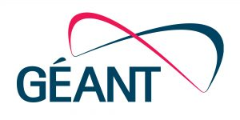

eduVPN is an initiative of SURFnet, NORDUnet, DeiC and AARNet to make VPN 
technology commonly available, by building better and more user-friendly tools. 
Security wise eduVPN will raise the bar in comparison with other VPN solutions. 
The joint effort is aimed at making eduVPN as "The VPN standard" for the NREN 
community. The Vietsch Foundation and SIDN fund decided to co-fund eduVPN.

The Commons Conservancy as an organisation was set up to help mature upcoming 
efforts around open technologies, and facilitate healthy and self-supporting 
ecosystems that are sustainable in the long term, by providing an 
infrastructure for coordination as well as a proper legal framework for 
governance over contributions made to the projects. SURFnet, NORDUnet and 
AARNet have started the process, via GÉANT's Greenhouse SIG, to board as a 
programme within The Commons Conservancy.

GÉANT's role is about defining, maintaining and enforcing the eduVPN governance 
structure including the policies that are needed in order to deploy eduVPN as a 
NREN.
