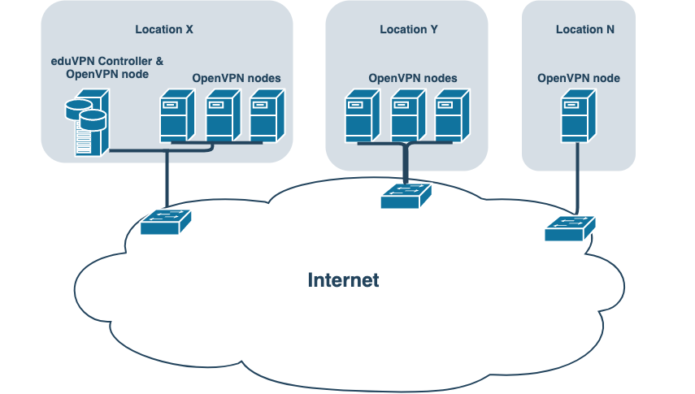

With the ongoing global 
[COVID-19](https://en.wikipedia.org/wiki/Coronavirus_disease_2019) crisis, many 
people need to start working from home. Typically, the use of a VPN is required 
to be able to keep working. Many current VPN solutions used by institutions can 
not cope with this situation, either due to hardware, software or license 
restrictions. eduVPN is a credible solution which does not suffer from these 
limitations and scales with your hardware, i.e. CPU and network capacity.

Most organizations start by deploying a single server, which can scale quite 
well to around 1000 simultaneously connected clients assuming at least 16 CPU 
cores with [AES-NI](https://en.wikipedia.org/wiki/AES_instruction_set) and 
adequate network performance, e.g. >= 10 Gbit interface(s).

But it is also possible to deploy extra servers with OpenVPN processes in order 
to allow for a higher number of concurrent users, or distribute over different
locations. Per server (with 16 cores and >= 10 Gbit) another 1000 clients can 
connect. (However, just as with other VPN solutions this assumes no other 
restrictions are in place that may limit connection speed, e.g. NAT and/or 
firewalls.)

When using multiple servers, there is a distinction between controller and 
node(s). The controller runs the portal and API, the node runs the OpenVPN 
process(es). 

As described in our documentation, 
[here](https://github.com/eduvpn/documentation/blob/v2/SCALING.md) and 
[here](https://github.com/eduvpn/documentation/blob/v2/ADD_DAEMON_NODE.md), a 
typical deploy looks like this:

* Machine 1 has both controller and node functionality in location X;
* Machine 2 has node functionality in location Y;
* Machine n has node functionality in location N.

In order to securely add node(s) to your VPN setup we implemented a simple VPN 
daemon that runs on the node(s). The communication channel between the 
controller and node is protected by TLS (client certificates) when contacting 
remote nodes.

You can also deal with scaling up by assigning different profiles to your 
end-users, allowing for example split-tunneling for certain users in order 
to offload your infrastructure and to protect specifically the traffic between 
their machines and the resources at the institution.

[Contact](../contact.html) us if you have any questions!
