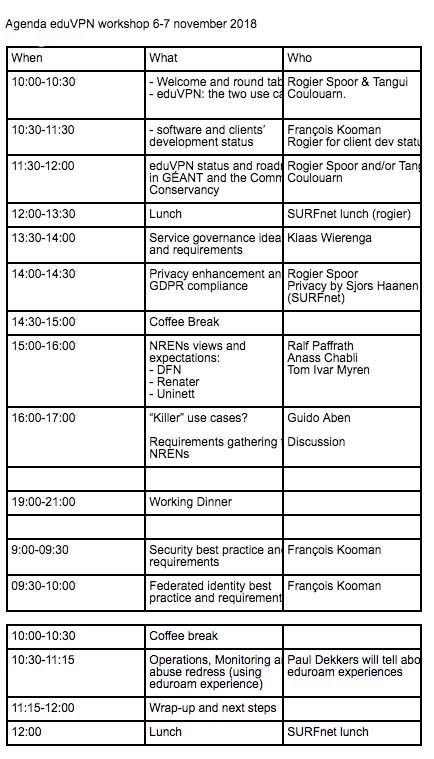

In November we organized a two-day eduVPN workshop at SURFnet office in the 
Netherlands. This goal of the workshop was to bring together representatives of 
NRENs who are currently deploying the service in production and in test and to 
see how we can work together in the future. Topics addressed during this 
workshop were:

- "The service": what is the current status? What is the division of work 
  between GÉANT, the Commons Conservancy and other partners?
- "Policies": how to deal with GDPR? What should be the AUP? What is abuse and 
  how should we react to it?
- "Requirements and best practices": for security/operations/identity 
  management/monitoring. 

Representatives from the following NRENs attended the workshop: DeiC, AARNet, 
GÉANT, SURFnet, RENATER, DFN, Uninett, RENU, CSC and PSNC. A more detailed 
agenda of the event is shown below:

