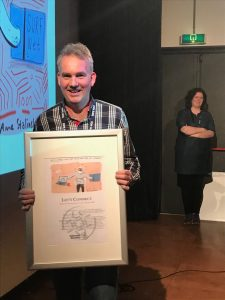

eduVPN is a brand name we use for the educational & research community. For 
the software we're developing we use the name: Let's Connect!

Let's Connect! has won the ISOC.NL Innovation Award 2018. The Jury said: 

> A very necessary technical innovation with potentially a huge social impact. 
> For secure connections, but also for free internet, we are really dependent 
> on good VPN technology, especially now that net neutrality is under 
> international pressure. A deserved winner of the Internet Innovation Award 
> 2018!

[https://awards.isoc.nl/innovatie/](https://awards.isoc.nl/innovatie/)
