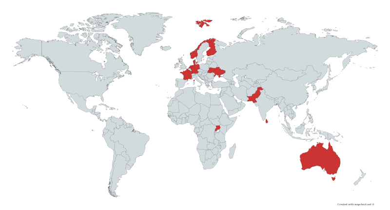

As of September 2019, two additional countries are available to the users of 
the eduVPN [applications](../apps.html): Finland, operated by FUNET, and 
France, operated by RENATER. In addition, in October, Sri Lanka was added!

eduVPN servers are now available in 11 countries. This means that research and
education users from those countries can access Internet through those 
endpoints once authenticated to their own country's eduVPN server.

If you are willing to protect your community from the risks of public WiFi, and 
interested in joining eduVPN community by operating such a national instance, 
please contact us at 
[eduvpn-support@lists.geant.org](mailto:eduvpn-support@lists.geant.org).

Currently, we have eduVPN servers in Australia, Denmark, Finland, France, 
Germany, The Netherlands, Norway, Pakistan, Sri Lanka, Uganda and Ukraine!

[Contact](../contact.html#server-operators) your NREN if you do not have access yet!

