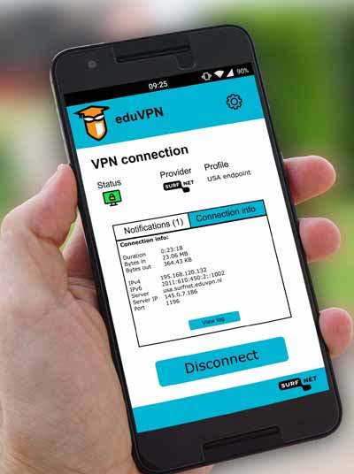

eduVPN integrates smoothly with federation services via SAML and currently most 
effort is put on creating easy-to-use and secure apps for Android, iOS, Windows 
and macOS. The server side components have been released end 2016. In December 
it was decided to support federated eduVPN as an additional feature to eduVPN. 
This will allow a user as a guest to make use of other NREN's eduVPN servers, 
just like eduroam provides guest access too. In order to make it user-friendly 
this will create a second federation layer on the VPN level.

The android eduVPN app was released  in January and the macOS, Windows app 
(7,8 and 10) and Linux app are expected in October.

All software, technical documents and generic documentation are published on 
[GitHub](https://github.com/eduvpn/).
